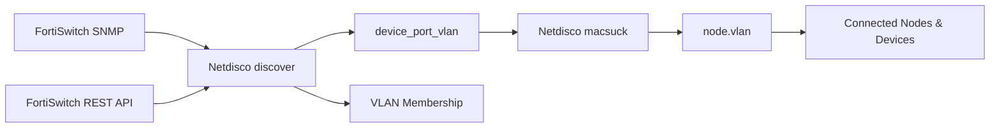

# Netdisco Fortinet Plugin

<p align="center">
  <strong>Fortinet device discovery and FortiSwitch dynamic VLAN mapping for Netdisco.</strong>
</p>

<p align="center">
  
  
  
  
  
</p>

This repository provides Netdisco worker plugins for Fortinet environments. It improves discovery of Fortinet network devices and adds FortiSwitch-specific support for dynamic VLAN assignment when that operational VLAN data is not fully represented by standard SNMP discovery.

It keeps the Netdisco model intact:

- `discover` remains responsible for infrastructure inventory and VLAN membership.
- `macsuck` remains responsible for endpoint MAC data.
- Fortinet REST data is used where SNMP alone does not expose enough operational context.

## Capabilities

This plugin has two related but separate scopes:

| Scope | Applies To | Purpose |
|---|---|---|
| Fortinet discovery | Fortinet devices discovered by Netdisco | Improves model, OS version, DNS, port properties and neighbor data. |
| FortiSwitch dynamic VLANs | FortiSwitch access switching | Maps dynamically assigned operational VLANs into Netdisco VLAN membership and endpoint views. |

## Problem Solved

In FortiSwitch deployments with dynamic VLAN assignment, a port can have:

- a native VLAN visible through normal port inventory;
- an operational VLAN learned from endpoint authentication or policy;
- endpoint MACs that should be stored against the effective VLAN.

Without the extra Fortinet data, Netdisco can show stale or incomplete VLAN membership and endpoints can appear under the native VLAN instead of their actual operational VLAN.

The discovery workers also help Netdisco identify Fortinet devices more accurately by enriching model, OS version, DNS, port property and LLDP neighbor data.

## FortiSwitch VLAN Data Flow



## What It Does

| Area | Result |
|---|---|
| Fortinet device discovery | Improves model, OS version, DNS, port properties and neighbor mapping for Fortinet devices. |
| FortiSwitch dynamic VLANs | Reads FortiSwitch operational MAC data from `/api/v2/monitor/switch/mac-address`. |
| VLAN membership | Updates Netdisco port VLAN membership with the effective operational VLAN for FortiSwitch ports. |
| Endpoint storage | Lets macsuck store endpoint MACs on the effective VLAN when available. |
| Device port view | Optionally shows dynamic VLAN hints in `Connected Nodes & Devices`. |

## Repository Layout

| Path | Purpose |
|---|---|
| `lib/App/NetdiscoX/Worker/Plugin/Discover/VLANs/FortinetVlans.pm` | Refreshes Fortinet port VLAN membership using SNMP plus FortiSwitch REST MAC data. |
| `lib/App/NetdiscoX/Worker/Plugin/Macsuck/Nodes/FortinetNodes.pm` | Stores Fortinet endpoint nodes and applies the effective VLAN when available. |
| `lib/App/NetdiscoX/Worker/Plugin/Discover/Neighbors/FortinetNeighbors.pm` | Improves Fortinet LLDP neighbor mapping using REST data. |
| `lib/App/NetdiscoX/Worker/Plugin/Discover/PortProperties/FortinetPortProperties.pm` | Improves Fortinet port property discovery. |
| `lib/App/NetdiscoX/Worker/Plugin/Discover/Properties/FortinetProperties.pm` | Improves Fortinet device model, OS version and DNS discovery data. |
| `share/views/ajax/device/ports.tt` | Optional Netdisco port table override for dynamic VLAN display. |
| `config/deployment.example.yml` | Minimal Netdisco configuration example. |

## Quick Start

Install the files into Netdisco's local site directory:

```sh
mkdir -p "$NETDISCO_HOME/nd-site-local/lib"
mkdir -p "$NETDISCO_HOME/nd-site-local/share/views"
rsync -a lib/ "$NETDISCO_HOME/nd-site-local/lib/"
rsync -a share/views/ "$NETDISCO_HOME/nd-site-local/share/views/"
```

For Docker deployments, use the host directory mounted as `netdisco/nd-site-local`.

Enable local plugin loading and the Fortinet workers in `deployment.yml`:

```yaml
site_local_files: true

extra_worker_plugins:
  - "X::Discover::VLANs::FortinetVlans"
  - "X::Discover::Neighbors::FortinetNeighbors"
  - "X::Discover::PortProperties::FortinetPortProperties"
  - "X::Discover::Properties::FortinetProperties"
  - "X::Macsuck::Nodes::FortinetNodes"

device_modules:
  - class: SNMP::Info::Layer3::Fortinet

device_auth:
  - tag: fortinet_api_credentials
    only:
      - vendor:fortinet
    username: "FORTINET_API_USERNAME"
    password: "FORTINET_API_PASSWORD"
```

If FortiGate controller endpoints are also used, add the controller host details:

```yaml
device_auth:
  - tag: fortinet_api_credentials
    only:
      - vendor:fortinet
    host: "FORTIGATE_HOST_OR_IP"
    port: 443
    username: "FORTINET_API_USERNAME"
    password: "FORTINET_API_PASSWORD"
```

Token authentication can also be used:

```yaml
device_auth:
  - tag: fortinet_api_credentials
    only:
      - vendor:fortinet
    token: "FORTINET_API_TOKEN"
```

Restart Netdisco after changing worker plugins. Restart the web service too if installing the optional `ports.tt` view override.

```sh
docker compose restart netdisco-backend netdisco-web
```

## Validation

Run a general discovery for a Fortinet device:

```sh
netdisco-do discover -d FORTINET_DEVICE_IP
```

For FortiSwitch VLAN membership, run a focused VLAN discovery:

```sh
netdisco-do discover::vlans -d FORTISWITCH_IP
```

Then run macsuck:

```sh
netdisco-do macsuck -d FORTISWITCH_IP
```

Check the device port page for:

- improved Fortinet model, OS version, DNS, port property or neighbor data;
- dynamic FortiSwitch VLANs in VLAN membership;
- endpoint MACs stored on the effective VLAN when applicable;
- `Connected Nodes & Devices` showing `(on vlan VLAN_ID)` when the endpoint VLAN differs from the native VLAN.

## REST Endpoints

The FortiSwitch dynamic VLAN workflow uses this endpoint:

```text
/api/v2/monitor/switch/mac-address
```

Neighbor and auxiliary Fortinet discovery data may use additional Fortinet monitor endpoints, depending on the enabled worker.

## Operational Notes

- Credentials are read from Netdisco configuration, not from plugin source code.
- The discovery workers run only for devices that Netdisco identifies as Fortinet.
- Stale MAC entries and trunk-learned entries are skipped when calculating FortiSwitch dynamic VLAN membership.
- Dynamic VLAN membership is operational FortiSwitch data and should be refreshed at the cadence required by the environment.
- `share/views/ajax/device/ports.tt` is a full template override. Recheck it after Netdisco upgrades because upstream template changes may need to be merged.
- `SNMP::Info::Layer3::Fortinet` must be available in the Netdisco installation.

## Privacy And Sanitization

This repository is intended to be reusable in any Netdisco deployment. It does not include environment-specific data such as:

- real Netdisco deployment configuration;
- production credentials or API tokens;
- customer hostnames, domains or device names;
- real IP addresses or MAC addresses;
- exported Netdisco database content.

All configuration values in the examples are placeholders and must be replaced with deployment-specific values before use.

## Suggested Schedule

If endpoint VLAN accuracy matters throughout the day, run Fortinet VLAN discovery at a similar cadence to macsuck.

Example:

```text
discover::vlans for FortiSwitch devices: every 2 hours
macsuck for FortiSwitch devices: every 2 hours
```

This keeps VLAN membership and endpoint node VLANs aligned without changing the intended role of either Netdisco workflow.

## License

This project is distributed under the GNU General Public License v3.0. See `LICENSE` for details.
